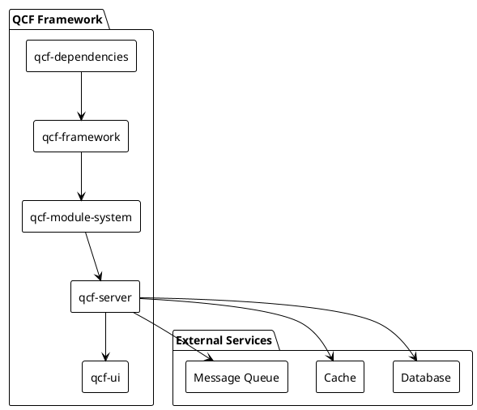
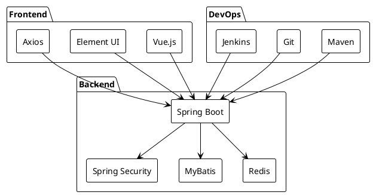
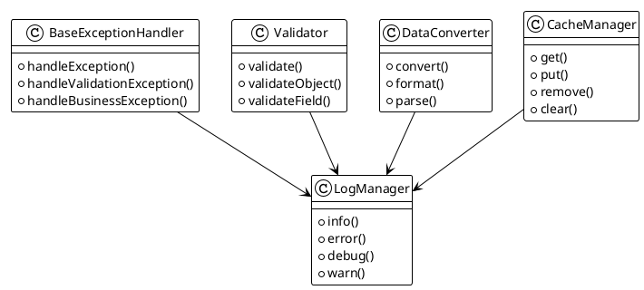
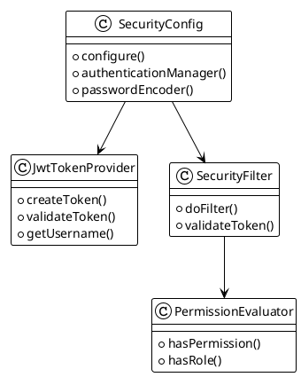
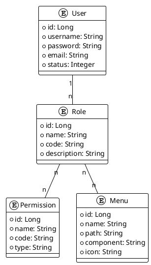
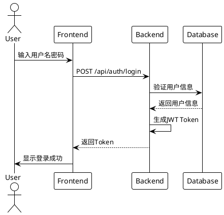
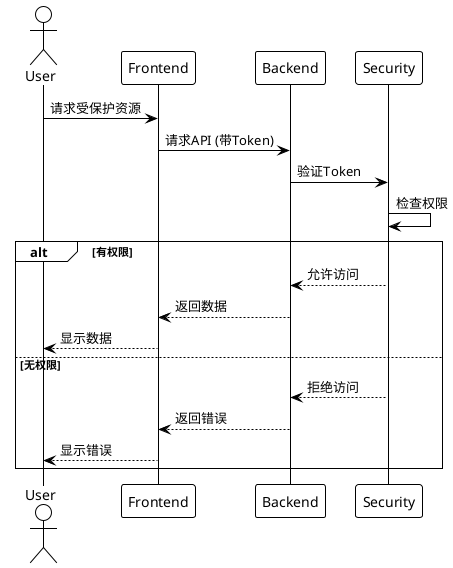
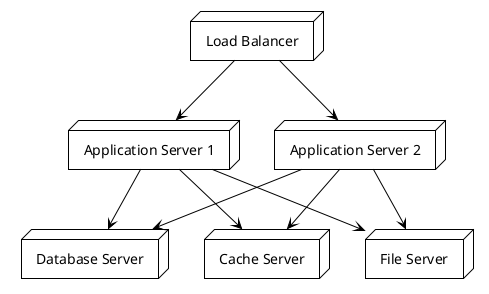
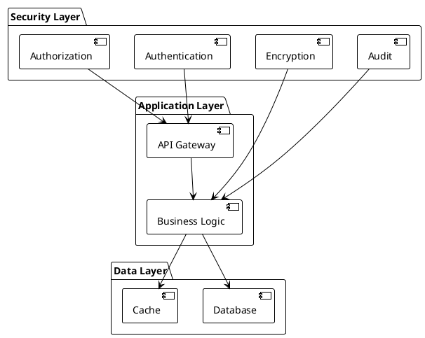
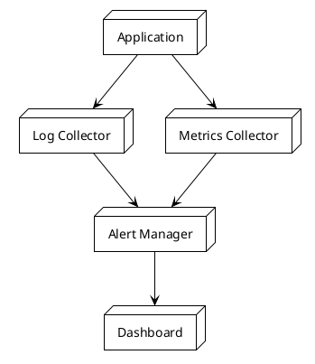

# Quick Cloud Framework (QCF) 系统设计文档

## 1. 系统架构设计

### 1.1 整体架构图



### 1.2 技术栈架构



## 2. 核心模块设计

### 2.1 基础框架模块



### 2.2 安全模块



## 3. 数据库设计

### 3.1 核心实体关系图



## 4. 接口设计

### 4.1 认证接口时序图



### 4.2 权限验证时序图



## 5. 部署架构

### 5.1 部署架构图



## 6. 开发规范

### 6.1 代码结构规范

```
qcf-framework/
├── src/
│   ├── main/
│   │   ├── java/
│   │   │   └── com/
│   │   │       └── quick/
│   │   │           └── cloud/
│   │   │               ├── common/        # 通用工具类
│   │   │               ├── config/        # 配置类
│   │   │               ├── exception/     # 异常处理
│   │   │               ├── security/      # 安全相关
│   │   │               └── util/          # 工具类
│   │   └── resources/
│   └── test/                              # 测试代码
└── pom.xml
```

### 6.2 命名规范

1. 包名：全小写，使用公司域名反写
2. 类名：大驼峰命名法
3. 方法名：小驼峰命名法
4. 变量名：小驼峰命名法
5. 常量名：全大写，下划线分隔

## 7. 安全设计

### 7.1 安全架构图



## 8. 监控设计

### 8.1 监控架构图

